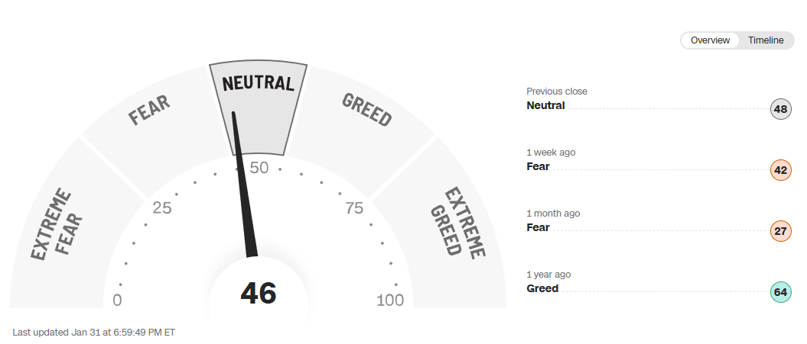

[Video Blog]()

## Major Indices VS My RRSP
New year same old RRSP, one of the items I have debated about is swapping VTI for VOO but historically small caps have outperformed and hopefully that will bring outsized returns for VTI this year. January is the first month VTI beat the S&P 500 Index since I started the blog.

Just like last month in my RRSP, XAW was the clear winner! All 4 of my holdings were positive this month (same as the indices) so we can start the streak over at 1. 😆 

  | **Ticker** | **Index**  | **2025-01-01** | **2025-01-31** | **Percentage Gain** |
  | ---------- | ---------- | -------------- | -------------- | ------------------- |
  | .INX       | S&P 500    | 5868.55        | 6040.53        | 2.93%               |
  | .IXIC      | Nasdaq 100 | 19280.79       | 19627.44       | 1.80%               |
  | .DJI       | Dow Jones  | 42392.27       | 44544.66       | 5.08%               |
  | TX60       | TSX 60     | 1491.19        | 1540.76        | 3.32%               |

  | **Ticker** | **My RRSP ETFs** | **2025-01-01** | **2025-01-31** | **Percentage Gain** |
  | ---------- | ---------------- | -------------- | -------------- | ------------------- |
  | VDY        | FTSE Index CAD   | 49.44          | 50.24          | 1.62%               |
  | XAW        | Many Indexes     | 44.70          | 46.64          | 4.34%               |
  | SCHD       | Subset of Dow    | 27.26          | 27.83          | 2.09%               |
  | VTI        | Total US Market  | 289.26         | 298.6          | 3.23%               |

## My Moves
New year time to shake things up, in my partners account we sold HDIF + GDV and bought BANK. Personally I had several moves in my TFSA throughout the month and like always made a singular buy in my RRSP at the end of the month.

### TFSA Buys & Sells
  - Manually dripped **SPLT** as a part of us investing a portion of our joint account.
  - Sold all of my **ETHY** after watching it rise and fall for many months I sold it for break even (ignoring dividends)
    - with that money I bought **QQCL** and **HXQ**
  - Bought **HXQ**
  - Bought **QQCL**
  - Bought **HYLD**
    - It's been a long time bought some more slightly under current book cost. Thinking of keeping it a similar weight to QQCL
  - Bought **UTES**
    - Extremely small position mostly to watch it, currently thinking of swapping AQN into UTES
  - Sold some **TD**
    - Proceeds plus some cash right into **BANK**
  - Sold out of my small **PLTH** gamble which didn't work
    - Bought **QQCL** with proceeds

One more thing before diving into the breakdown is that I have started putting more than the minimum against my line of credit used to buy BANK last July. My teaser rate of 4.99% expires early March. With a revolving rate of approximately 11.5% currently and with the whole tariff situation I decided to scale back the purchasing slightly and tackle some of this debt now.
- *Please note that BANK's dividend alone is more than enough to cover the revolving rate if I needed it.*

### TFSA Breakdown

- *percentages are calculated based on current market value*
- *the entirety of BANK was purchased with a line of credit offer. It has worked out well for me but I would not recommend. I will re-evaluate in Feb 2025 when offer expires*
- *SPLT is my wife and I's joint emergency fund.*

Positions I am thinking about consolidating are:
  - **AQN** still bag holding here, may soon be time to cut my losses
  - **ATD** bought 2/3 March 2023 or earlier but since mid 2023 it has been a bit of a dog
  - **T** Thinking of selling out of this one and increasing **UTES** and adding more to **BANK**

#### Breaking out each Account

### RRSP Buys

This month I kept it simple and did a small purchase into VDY. February and March are usually pretty big months for me due to tax return funds

### RRSP Breakdown

- *percentages are calculated based on current market value, USD is converted to CAD based on google finance rate*

### Dividend Increases and Decreases
Not a whole lot going on in terms of dividends this month. One thing to call out is now with the many rate cuts here in Canada, with another just this past Wednesday January 29th 2025, our HISA ETFs are paying out significantly less. May look at switching **PSA** to **PREF** like I switched **CASH** for **SPLT** back in the summer.

## Fear and Greed Index

## Wrap Up

That's all for this months review thank you for reading. Lot's going on at the moment and who knows what will come of all of the tariffs. One thing is for certain I will continue DCAing into my accounts and writing posts for all of you!

You can support me by:
- [Subscribing to my YouTube Channel](https://www.youtube.com/@FinancialFreedomAnOdyssey?sub_confirmation=1)
- [Using my WealthSimple referral link](https://my.wealthsimple.com/app/public/trade-referral-signup?code=VUGTXQ)
- Simply continuing to read my weekly posts here.

Cheers ☕