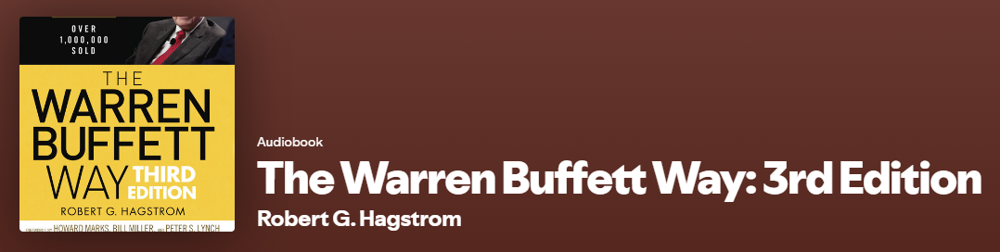

## Picking this book
There's no big story this time it simply was one of the recommendations that was made at the end of the Wealthy Barber audio book. I wrote a post on that one as well and it can be [found here](/posts/the-wealthy-barber). While both suggestions sounded intriguing I could not pass up an opportunity to learn more about Buffet's journey. Potentially my favourite success story of Buffet's, or at least prior to reading this book, is the Coca Cola story.

## Coca Cola Story
In 1988 Buffet bought more than $1billion in the Coca Cola company (KO). He started the position in 1987 when the stock had continued to fall, thus Buffet ended up creating a floor for the share price, at first unbeknownst to management. When the then president and CEO Donald Keough caught wind of the mysterious investor was hailing from the midwest he then called up his friend Warren Buffet. Buffet told Keough that indeed that was him and to please keep it quiet until he was finished buying.

At that time Buffet's investment was about 1/3rd of Berkshires AUM and was for about 7% of KO. Fast forward to the end of 2024 and he still hols 400 million shares valued at $28.5 billion paying 0.51 cents a share per quarter as of April 1st 2025. Which means his shares now pay about 1/5 of his initial investment back as a dividend. Absolutely unreal

## Backstory
First stock purchase at 11 years old stocks immediately dipped and once it finally became a small gain he sold it. After this he never sold until a large gain was had.

Age 25 was his first limited liability partnership with a goal to beat DOW by 10% and he beat it by 20%.

Buffet does not believe in the efficient market theory or at least that it isn't instantaneously efficient in most situations. Put another way there are often windows of opportunity if you know how to look.

Buffet claims he won the genetic lottery and was lucky with timing. Sure that may have been true for his early years but there is definitely more than luck after decades of success. It is for that reason that so many have followed Buffet's decisions from the little guy like me to the US Government and FED back in the financial crisis of 2008.

## Early Teachers
- Graham's rule don't lose money
  1. Look for stocks trading 2/3 or less of their real value
  2. Low P/E ratio

- Phillip Fischer Philosophy purchase quality over a bargain. Fischer had a unofficial business partner Charlie Munger who would become one of the most influential people in Buffet's life.
  - See's Candies was purchased and still owned today by Berkshire at Munger's recommendation and it was one of Buffet's first quality over 

## Warrens Beliefs
  - His success has nothing to do with intelligence and everything to do with patience and rationality.
  - Which is all well and good but he must have a system right... you are correct introducing:

### The Twelve Tenets of Buffet's Investment Thesis
1. Is the business simple and understandable?Is the business simple and understandable?
2. Does the business have a consistent operating history?
3. Does the business have favorable long-term prospects?
4. Is management rational?
5. Is management candid with its shareholders?
6. Does management resist the institutional imperative?
7. Focus on return on equity, not earnings per share.
8. Calculate “owner earnings.”
9. Look for companies with high profit margins.
10. For every dollar retained, make sure the company has created at least one dollar of market value.
11. What is the value of the business?
12. Can the business be purchased at a significant discount to its value?

## Mr Market: an allegory by Ben Graham
A business can be solid with a great outlook, but, depending on the day Mr. Market will offer a low, fair or even high value. The nice thing is that Mr. Market will make its offer each day and you can reject it without consequence. The only thing you shouldn't do is submit to the mr market.

From this stems the entire field of investing psychology like:
  - Finding money one day seems like free money but when you lost it, it was something else. It is not special or free, it is simply 5 dollars
  - Myopic loss aversion, holding an investment for longer makes it more attractive to the investor if it isn't evaluated frequently.

## Summary
I thoroughly enjoyed this audiobook and would recommend it to anyone is at least at a medium level of interest and has foundational knowledge of business valuations and the stock market. It does not read like a story such as books like the Wealthy Barber which is a story, but, more like a collection of anecdotes with learnings in between.

We are currently in a very fearful time with the fear and greed index at 13, and the Nasdaq down 11% year to date. On that note I will leave you with a few Warren Buffet quotes:
  - "Be fearful when others are greedy and greedy when others are fearful."
  - "The stock market is designed to transfer money from the Active to the Patient."
  - "Opportunities come infrequently. When it rains gold, put out the bucket, not the thimble."

To be clear in that ast quote it may not be raining gold today but I think it doesn't hurt to at least start setting up. Now for one more quote that I have hear from at least 3 people this past week
  - "When in doubt zoom out"

If you've read either of the above books, or any of the three that I have read so far, I would love to hear your takes on them.
- You can reach me over on Blossom @financialfreedomanodyssey or on my youtube channel.

Thanks for stopping by and I hope to see you back here next week for my Q1 2025 review!

You can support me by:
- [Subscribing to my YouTube Channel](https://www.youtube.com/@FinancialFreedomAnOdyssey?sub_confirmation=1)
- [Using my WealthSimple referral link](https://my.wealthsimple.com/app/public/trade-referral-signup?code=VUGTXQ)
- Simply continuing to read my weekly posts here.

Cheers ☕