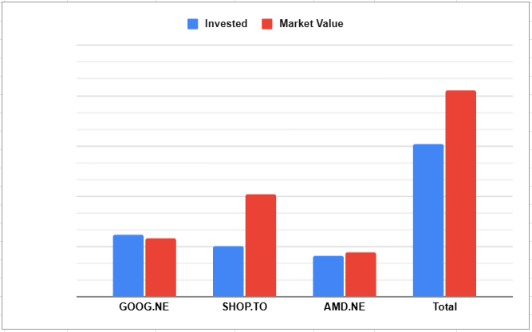

My philosophy for owning these 3 stocks is because I believe they are extremely undervalued and relatively safe in the medium to long term. For this post I won't expand much more than that but, if you are curious I go more in depth in this [post.](/posts/why-am-i-buying-google-and-amd)

**Performance:**

## GOOG April 24th
Google had a fantastic earnings, it was up 5% after hours day of the call.
- Revenue beat by over $1billion,
- EPS was $2.81 vs $2.01
  - Almost 40% higher than anticipated!

Honestly we have to put our hands together for google so far my decision to start a position is looking mighty fine.

$95 billion in cash and cash equivalents with only $10billion is outstanding debt

Total stockholder equity is $345 billion!!

One crazy callout is that revenues were up 14% with less marketing / ad spend

Net Income year over year was $34.5 billion vs $23.7 billion

### Revenue Streams Year Over Year
- Search
  - up just shy of 10%
- Youtube Ads
  - up 11%
- Google Network
  - down 2.5%
- Google Services Total
  - up 9.7%
- Google Cloud
  - up 27%
  - Operating income was well over up 100% with revenue not even close to this much growth. This means they are likely finally achieving economies of scale

Two other fantastic things were announced as well: 
1. They have approved $70 billion stock re-purchase plan
2. 5% increase to the dividend was announced which will apply for the June 2025 payout

### Summary
All in all, Google delivered an outstanding earnings report, beating revenue and EPS expectations by wide margins and posting strong year-over-year growth across key segments like YouTube and Cloud.
With $95 billion in cash, minimal debt, and a $70 billion stock buyback plan, the company’s financial strength is undeniable.
I will continue to hold onto this one!

## AMD May 6th
- Completion of the acquisition of ZT Systems was announced on March 31st
  - this is needed for them to reach NVIDIA status over the next 5-10 years
- Revenue Growth 36% YoY, absolutely crushing it
  - data centre, client and gaming
- GAAP Margin 50%, non-GAAP 54%
  - both slightly up
- Operating income GAAP went from $0.04 billion in Q1 2024 to $0.8billion this quarter
- Diluted EPS 44cents vs 7 cents Q1 2024
  
### Data Centre
- THe big play
- Revenue 3.7 billion vs 2.3 billion YoY which is up 57%!
  - It should be noted that MI350 has not launched yet which is expected to take us closer to NVIDIA offerings
    - Mid 2025 for these
- Operating margin up to 25% vs 23% YoY
  
### Client and Gaming
- Eagle eyed readers will note that these were previously separate but they are now combined into one division
- Gaming is currently a big drag, expected to grow in the back half of 205
- Operating margin from 10% up to 17% so we are getting some positive movement

### Embedded
- Down 3% YoY
  - Last Quarter was down 13%
  - Quarter before down 25%
  - So it is actually trending far better potentially even headed towards growth next quarter

### Summary
Guidance is for $7.4billion for Q2 2025 with a +/- of $300 million
- They played this game last Quarter as well and were up $300 million over guidance

Looking through their income statement I have to say I am glad I took the plunge and perhaps I may even add some more. You will have to keep reading to find out 😉

## SHOP May 8th
"Merchant success drives an excellent Q1!" - Love the headline
- 27% Revenue Growth
  - 23% Q1 2024
- 15% free cash flow margin
  - 12% Q1 2024
- "We have now achieved eight consecutive quarters of pro forma revenue growth of 25% or more and seven consecutive quarters of GMV growth greater than 20%, all while increasing our free cash flow."
- Revenue $2.360 billion vs $1.861 billion last year
  - This was up 1.18% vs expected
- Net Income $226 million vs $144 million last year

The main negative this quarter was an EPS miss $0.26 expected vs $0.25 reported

### Summary
Shopify definitely had the weakest financials of the three but I am far from concerned and will continue to hold! I believe people will continue to increase spending straight through to the end of the year.

## Wrap Up
I will continue to hold all 3 of these tech stocks and hopefully we will get to ride the green days up and to the right!

That's all for Q1 earnings reports in tech, I am still waiting to hear about TD's earnings and I will report on them with Telus' over the coming weeks.

You can support me by:
- [Subscribing to my YouTube Channel](https://www.youtube.com/@FinancialFreedomAnOdyssey?sub_confirmation=1)
- [Using my WealthSimple referral link](https://my.wealthsimple.com/app/public/trade-referral-signup?code=VUGTXQ)
- Simply continuing to read my weekly posts here.

Cheers ☕