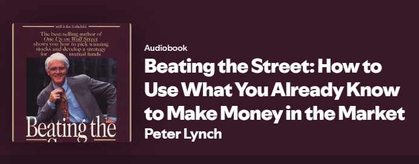

## Picking this book
This was pretty simple I was looking to do a few hours worth of chores around the house and decided to listen to an investing book. I had heard about Peter Lynch's success especially while being the manager of the Magellan Fund for many years. Which he averaged returns over double of the S&P 500 by the way. Aside from that I didn't really know much about his philosophy, last night once again I heard about his book Beating the Street and decided to give it a listen. Luckily I found it on spotify and it turned out to be an abridged version a mere 3 hours of listening at 1x speed which I left it at.

**Side Note:** It is also narrated by Peter himself which I thought was cool to see.

## Review

Early on Peter touches on a topic that I have often thought about even though I am definitely not there yet. That topic is why he decided to quit working or "shut down his terminal exactly 13 years to the day". He realizes that he has had incredible success and is incredibly grateful for that success but, he is worried that he knows companies better than is own kids. After he leaves the fund he notes he is joining the ranks of the amateur investors once again. This statement made me laugh and later I would learn that it wasn't a joke.

The importance of seeing the big picture is a main theme throughout the book and an advantage to the amateur investor. Buying stocks on a regular schedule like one would do in their 401K is the best way to not be scared out of stocks. A decline in stocks is not a surprising event it's a recurring event as normal as frigid air in Minnesota. Realizing this and being ready for it just like one is ready for winter and can take advantage.

Seeing the big picture (when in doubt zoom out) and the ability to be agile are some of the biggest advantages that the amateur investor has compared to the street. In being agile the amateur can stay alert to trends whether in the media or out in the wild. This is something that the guys over at Dumb Money often talk about as well. Especially Chris who apparently watches hours of Tiktok every day as part of his research.

The answer is in the numbers, Lynch outlines how he evaluates a company's financial health using basic metrics (like P/E ratios, earnings growth, debt levels). Encouraging listeners learn how to read financial statements, as numbers reveal the story behind a company. Debt levels are nuanced in many ways but the two that stuck out to me is when is the debt due for renegotiation and perhaps more importantly who holds the debt. If banks choose the debt they are the most likely party to call on the debt.

Heads up if you choose to listen to the audio book you will periodically hear a trumpet followed by Peter's Principles. I will leave you with my favorites:

## Some of Peter's Principles
1. Gentleman who prefer bonds are making a big mistake
   - *I’ve said before that an amateur who devotes a small amount of study to companies in an industry he or she knows something about can outperform 95 percent of the paid experts who manage the mutual funds, plus have fun in the process.*

2. Never invest in any idea you can’t illustrate with a crayon.
   - *You can lose money in a very short time but it takes a long time to make money.*
   - *You should not buy a stock because it’s cheap but because you know a lot about it.*

3. You can’t see the future through a rear view mirror.

4. As long as you are picking a fund or in 2025 terms an etf you might as well buy a good one.
   - *AKA invest in an index fund or a couple index funds*

5. Stock picking is art and science
   - *successful investing requires both analytical rigor (science) and intuition or judgment (art). It’s not just about crunching numbers—it’s also about understanding people, industries, and trends in a broader, more human way.*

6. The best stock to buy may be one that you already own
   - *General idea is to consider the stocks in your portfolio to see if you would like to add to them first before starting a new position which may lead you to pick the hot stock based on hype. Instead focussing on good companies at good prices to hold.*

7. When insiders are buying, it’s a good sign—unless they happen to be New England bankers.
   - *This is something I have been looking at for my individual stocks recently and I do this via Yahoo Finance -> Holders -> Insider Transactions*

## Summary
Although there wasn't a lot of new information to me in general investing knowledge I enjoyed listening to the stories especially those about the investing group and how sometimes his picks would run away before his group met. For a more succinct summary of the book I leave you with this.

Peter Lynch begins by sharing why he left his successful fund management career, to refocus on what matters most and rejoined the world of amateur investors with a fresh perspective. He highlights how everyday investors have key advantages, like staying agile, spotting trends early, and keeping a long-term view during market declines. Lynch stresses the value of understanding basic financials and doing your own research, showing that with a little effort, anyone can outperform the pros. Throughout the book, his “Peter’s Principles” offer clear, encouraging advice—like keeping it simple, trusting your instincts, and building on what you already know.

You can support me by:
- [Subscribing to my YouTube Channel](https://www.youtube.com/@FinancialFreedomAnOdyssey?sub_confirmation=1)
- [Using my WealthSimple referral link](https://my.wealthsimple.com/app/public/trade-referral-signup?code=VUGTXQ)
- Simply continuing to read my weekly posts here.

Cheers ☕