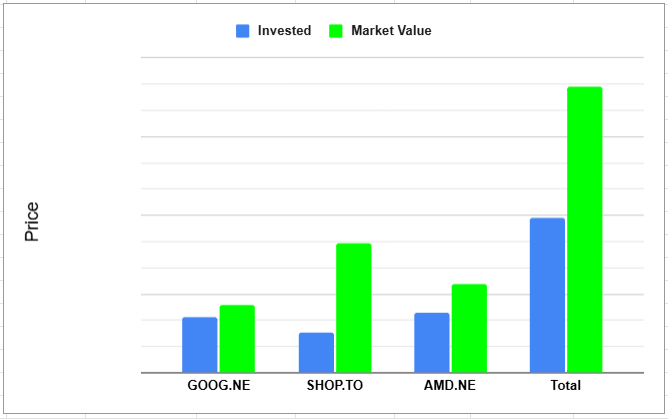

# Performance
So before we dive into each stock it's always good to take a look at how I'm doing in each position. **SHOP** is absolutely crushing it especially with their huge surge 21% in a single day post earnings. **AMD** has been doing very well as I only began its position this year. **GOOG** is positive but is still trailing the Nasdaq.

# GOOG July 23rd 2025
Earnings call was very promising for alphabet again this quarter. One of the main concerns in the face of the company is search. However we have now seen some acceleration here and growth up 11% in this category alone. Not bad to say the total revenue year over year was up 14%. Pretty good for a "dieing" business.

Google Cloud is absolutely crushing it up 30% year over year and nearing a $50 billion yearly revenue for the company. If this growth rate keeps up we will see it reach $100 billion in a short 3 years.

Net income increased 19% and EPS increased 22% to $2.31

## Revenue Streams Year Over Year in Millions
| Sector                 | Q2 2024 | Q2 2025 |
| ---------------------- | ------- | ------- |
| Google Search & other  | 48,509  | 54,190  |
| YouTube Ads            | 8,663   | 9,796   |
| Google Network         | 7,444   | 7,354   |
| Subscriptions          | 9,312   | 11,203  |
| Google Cloud           | 10,347  | 13,624  |
| Other Bets             | 365     | 373     |
| Hedging gains (losses) | 102     | (112)   |
| Total Revenue          | 84,742  | 96,428  |

## Summary
Looking ahead to 2026 we should expect an increase in CapEx spending. Next quarter is a very easy quarter to beat as it was very weak last year. Margin continues to go up and to the right finally breaking 20%, big thanks to Google Cloud Platform. Long story short I'm happy to continue holding this position.

# AMD August 5th
What a tear AMD has been on these last few months this has got to be the quickest gain that I have made over my 8ish years of investing. On the earnings call they matched on EPS and beat the expected revenue. This is the first quarter where EPS was not beat since 2022. Balance sheet is looking very strong and one nice thing to see is that liabilities has decreased from $1.8 billion to $1 billion.

Mi300 is just getting heated up and we are just starting to sell is the Mi350 and Mi355x which they have increased the price on already from $15k each to potentially even $25k

Revenue grew 32% YoY and next quarters guidance given was $400m ahead of Wallstreet's prediction and one thing to keep in mind is that Lisa Su tends to sandbag (aka give low estimates). This is the old under promise over deliver motto and I appreciate that as an investor.

Expectation is for $8.7 billion in revenue next quarter +/- $300 million and a gross margin of 54%, love to see that.

## Data Centre
- $3.2 billion in revenue up 14% YoY
- Operating margin was -5% which was primarily due to inventory and related charges with US export restrictions. THis eliminated sales of MI308 to China
  - They are in the process of unlocking this.

MI355 matches or exceeds B200 (NVIDIA) for key workloads at significantly lower cost and complexity. For upscaling inferencing, MI355 delivers up to 40% more tokens per dollar 😱
  - an example given was Oracle is building a 27,000-plus node AI cluster combining MI355x along with 5th gen Turin CPUs and Pollara 400 SmartNICs. This has lead to volume production of the MI350 series ahead of schedule in June.

Governments around the world have been adopting AMD as well

With the MI400 they are bringing everything they have learned to deliver Helios, a full-stack rac scale AI platform. Helios is purpose built for the most demanding AI workloads and can support 72 GPUs. It is expected to deliver 10x generational performance for the most advanced frontier models.

## Client and Gaming
- $3.6 billion in revenue which was up 69% YoY.
- Operating margin of 21%

## Embedded
- $824 million in revenue down 4% YoY
- Operating margin 33%

### Summary
Numbers wise Data Centre struggled while the other two segments did quite well. Data centre will continue to improve in myh opinion as the hyper scalers start adopting more of AMD's offerings. Over 100 new AMD-powered cloud instance launched this quarter, including multiple Turin instance from Google and Oracle CLoud that could deliver up to twice the performance of the previous generation. 

AMD now has nearly 1200 EPYC cloud instances available globally as providers expanding the breadth and regional availability of their AMD offerings, large wins were closed with dozens of aerospace, streaming, financial services, retail and energy companies.

I will continue to hang on to AMD and perhaps increase my number of shares!

# SHOP August 6th
- Total revenues went to $2,680 million from $2,045 million YoY
  - Cost of revenues went to $1,302 million from $1,045 million decent trade off there in my opinion
- Operating Expenses went way up to $1,011 million from $804 million

In terms of outlook and guidance we heard
- Revenue to grow at mid to high twenty percent rate on YoY basis
- Gross profit to grow at low twenty
- Operating expenses to be 38-39% of revenue
- Stock comp of $130 million
- Free cash flow margin to be in the mid-to-high teens

One thing to point out is that this marks the 11th quarter in a row of revenue beats

### Summary
I am now up over 3x on Shopify and did originally plan to sell once I hit this milestone. However I am going to hang on for awhile and see where this party goes.

# Wrap Up

You can support me by:
- [Subscribing to my YouTube Channel](https://www.youtube.com/@FinancialFreedomAnOdyssey?sub_confirmation=1)
- [Using my WealthSimple referral link](https://my.wealthsimple.com/app/public/trade-referral-signup?code=VUGTXQ)
- Simply continuing to read my weekly posts here.

Cheers ☕