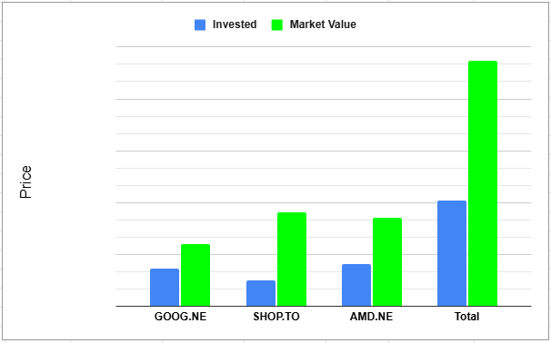

[Video Blog](https://youtu.be/2SmaTsDGCRk)

# Performance
So before we dive into each stock it's always good to take a look at how I'm doing in each position. All three positions have been doing extremely well over the last quarter with **AMD** still growing but **GOOG** really accelerating the stock price appreciation off of strong earnings. At time of writing both **AMD** and **SHOP** just released their earnings report so there hasn't been much time for the market to digest.

*Recorded November 5th 2025 before market open*

# GOOG: October 23rd 2025
Good old Google McDougall as Jeremy from Financial education would say had another fantastic quarter and I have to believe some of that is to do with them finally settling across several lawsuits. Also in August the DOJ ruled against Google and they are still working out what the punishment will be, known as the remedies phase. So we'll have to see what comes of all of those. Either way we had a great quarter and let's look into the numbers.

## Revenue Streams Year Over Year in Millions

| Sector                 | Q3 2024 | Q3 2025 |
| ---------------------- | ------- | ------- |
| Google Search & other  | 49,385  | 56,567  |
| YouTube Ads            | 8,921   | 10,261  |
| Google Network         | 7,548   | 7,354   |
| Subscriptions          | 10,656  | 12,870  |
| Google Cloud           | 11,353  | 15,157  |
| Other Bets             | 388     | 344     |
| Hedging gains (losses) | 17      | (207)   |
| Total Revenue          | 88,268  | 102,346 |

## Summary
As predicted last quarter Q3 easily beat year over year showing fantastic growth across all of the major revenue streams. Looks like the only one that slightly missed. This was Googles first ever $100 billion quarter! Revenue has doubled over the past 5 years. I have no plans to sell.

# AMD: November 4th
AMD continues to accelerate forward and sure it hasn't been always straight up but it continues to make higher highs perhaps 5 green days for every 1 red day. That's anecdotally by the way I didn't actually pull stats on that one. At time of writing we have seen a little pullback for about a week, but, now that we have seen another fantastic quarter in terms of earnings I would imagine we are on our way back up. 

3rd quarter revenue set a record of 9.2 billion! which is a 36% increase y/y. This growth is driven by demand across all of the businesses. Gross margin of 54% once again. The 9.2 billion beat even the top end of guidance from last quarter which was 9 billion. Guidance for next quarter is 9.6 billion +/- 300 million once again so we may see the first quarter over 10 billion!  

Let's take a look at the different branches success.

## Data Centre
- Revenue $4.3 Billion Up 22% y/y
  - Primarily driven by strong demand for 5th Gen AMD EPYC processors and AMD Instinct MI350 Series GPUs
- Operating Income $1.1 Billion vs. $1.0 Billion a year ago
  - Driven by higher revenue, partially offset by higher operating expenses

## Client and Gaming
- Revenue $4.0 Billion Up 73% y/y
  - Primarily driven by record sales of Ryzen processors, higher semi-custom revenue and strong demand for Radeon gaming GPUs
- Operating Income $867 Million vs. $288 Million a year ago
  - Driven by higher revenue partially offset by higher operating expenses

## Embedded
- Revenue $857 Million Down 8% y/y
  - Demand environment strengthened across multiple markets
- Operating Income $283 Million vs. $372 Million a year ago
  - Decline primarily due to lower revenue

### Summary
I will again continue to hang on to AMD!

# SHOP: November 4th
- Revenue: $2.84 billion, a 32% increase year-over-year and above analyst expectations.
- Gross Merchandise Volume (GMV): $92 billion, also a 32% increase year-over-year.
- Earnings Per Share (EPS): $0.3454 (adjusted), which beat the forecast of $0.3345.
- Merchant Solutions Revenue: $2.145 billion, up 38% year-over-year.
- Subscription Solutions Revenue: $699 million, up 15% year-over-year.
- Operating Income: $434 million, a 53% increase, but slightly missed analyst estimates.
- Free Cash Flow: $507 million with an 18% margin, highlighting a strong ability to translate growth into cash.

## Growth Drivers and Strategy
- International Expansion: Europe now represents 21% of overall revenue, and Asia Pacific growth was also highlighted.
- Enterprise Sector: The company is acquiring large brands, such as Starbucks and Canada Goose, reflecting success in the enterprise market.
- Artificial Intelligence (AI): Management emphasized that AI is central to their product development, particularly for commerce solutions. 

This marks the 12th quarter in a row of revenue beats

### Summary
I am now up over 3.5x on Shopify and did originally plan to sell once I hit this milestone. However I am going to hang on for awhile and see where this party goes.

# Wrap Up
I can contribute a fair amount of my TFSA gains to the three stocks listed above which is both exciting and troubling at the same time. It makes you think hey maybe I should have just put everything in those three stocks. However if we look back to how much they dropped in 2022 you have to wonder would you have been able to hold. Another consideration is that I have a fair amount of my portfolio in higher yielding tickers and just looking at stock price does not tell you the total return. Either way I am happy with how I have done this year.

Next week we will be looking at the single stocks that I sold and how they did vs what I bought with the proceeds of the sales!

You can support me by:
- [Subscribing to my YouTube Channel](https://www.youtube.com/@FinancialFreedomAnOdyssey?sub_confirmation=1)
- [Using my WealthSimple referral link](https://my.wealthsimple.com/app/public/trade-referral-signup?code=VUGTXQ)
- Simply continuing to read my weekly posts here.

Cheers ☕