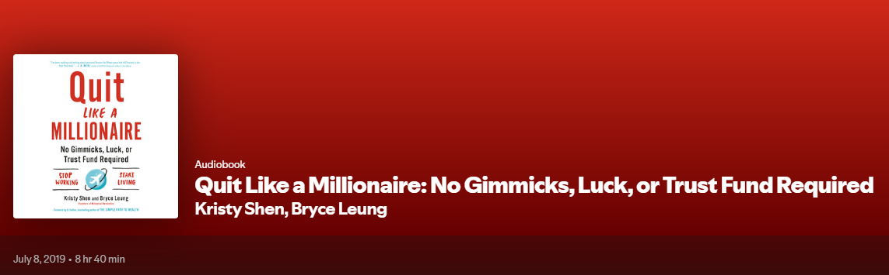

I have to say this was a fantastic audio book and even my partner enjoyed listening to it, at least in between car naps 😆. It's great to hear the story of a pair who end up working in the stressful life of tech who have such complimentary personalities and traits. Together being able to achieve FIRE well before the age of 35. Personally my retirement goal is still 55, but, books like this make me think about setting a lower target age. I will say like many other FIRE members Kristy and Bryce do not have children which is a big choice. A choice that is very polarizing, but, you cannot deny it can create a wildly different timeline. They do call this out near the end of the book and we will revisit that.

The beginning of the book has Kristy reflecting on growing up in extreme poverty in China and has a bit of a history lesson. Personally I found it interesting to learn about. She makes it extremely clear how any sort of waste growing up was absolutely not ok, to say the least. I believe many of us over here in North America could focus on dialing back our waste.

Through exceptionally hard work and schooling her father was able to make it across to North America and shortly thereafter send for his family and that is when Kristy moved to Canada. In Canada the family began to adjust to the new space and having abundance even though they focussed on not over indulging and sending as much money as possible back to family still in China.

Fast forward to professional life Kristy notes a manager who had a heart attack on the job and she immediately starts investigating how to quit working as soon as possible. To do so they would need to start investing and after some research she tries to go down to the bank and open an account in which they would buy low cost index funds. The sales person at the bank did what they do best and attempted to sell them high cost Mutual funds and even stating those index ETFs weren't available for their account type, wild but I believe it.

Through extreme frugality and a well timed conservative split between fixed income and stocks they were able to do extremely well out of the 2008 financial crisis and through 2012 and rebalancing they were able to consider early retirement. Interestingly I have read or listened to a lot of these types of stories and this is the first one where being conservative ended up being a big win. Fast forward to today I'm sure they would have better being 100% equities but they know there risk tolerance.

A huge contributing factor to their financial success is keeping there costs low. The biggest one is from geo-arbitrage. Their version of this is becoming ex-pats and spending many months of the year in low cost of living countries like Vietnam. Where you can live large for a few hundred US dollars a month. They also note other costs they save on by not needing insurance including life, car, auto. This is simply because they do not have any of those things. As someone who has a large mortgage, condo fees, utility rentals I am jealous. The other life choice they have made is not having kids.

Digging deeper into FIRE with children they noted their dislike for hearing things such as those with kids saying they are "lucky" this only works without them etc. Kristy notes this is likely bullshit, but, interviews a few successful FIRE individuals with kids to prove their point. Most of them point out the same things. First yes it will take a bit longer as you have expenses but that doesn't mean you can't optimize your spending in that area as well. This is something I can get behind. Most everything can be optimized in my opinion.

The book ends off discussing some statistics and chats about the 3 types of self made millionaires many of which come from poverty or even extreme poverty like the author (Kristy)
1. Investor
   1. Examples of the Investor millionaire are people like Warren Buffet and Jack Bogle. They had the ability to analyze companies assign a fair value for them and bought those that were trading significantly under their fair value. Investing in companies is risky and not everyone has the tolerance to ride out the downs.
2. Hustler
   1. Hustler is basically your entrepreneurs. I believe these are the second most common and can be the owner of your local Tim Horton's. Or in more extreme cases we have Zuckerberg, Musk and Bezos each who risked everything into one or more businesses and are now unbelievably wealthy
3. Optimizer
   1. This is by far the most common type of millionaire, likely due to the fact that it is the only type that is repeatable. You can optimize your expenses, income and buy low cost index funds. You cannot copy Zucherberg's story or Buffets investments.

Kristy and Bryce both fall into the optimizer category. Although I am far from being a millionaire I would also filter into that category. A fact that my partner was quite happy to say as we were listening.

## Summary

Overall, I found this book genuinely inspiring and surprisingly relatable, and I highly recommend it to anyone curious about the FIRE movement. Kristy and Bryce’s story blends practicality, discipline, and optimism in a way that feels achievable rather than extreme. Their honesty about the trade-offs they’ve made—especially around lifestyle, risk tolerance, and family choices; adds a refreshing layer of realism. The book pushed me to rethink my own timelines and reminded me just how powerful consistent optimization can be. If you’re looking for a motivating, down-to-earth look at financial independence, this one is absolutely worth your time.

Thanks for stopping by!

You can support me by:
- [Subscribing to my YouTube Channel](https://www.youtube.com/@FinancialFreedomAnOdyssey?sub_confirmation=1)
- [Using my WealthSimple referral link](https://my.wealthsimple.com/app/public/trade-referral-signup?code=VUGTXQ)
- Simply continuing to read my weekly posts here.

Cheers ☕