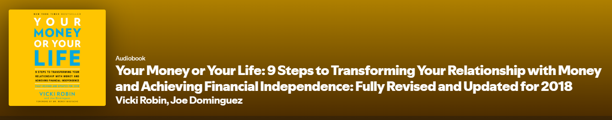

Your Money or Your Life is one of those rare personal finance books that doesn’t just tell you what to do with your money, it forces you to rethink what money is actually for. Listening to the audiobook felt less like consuming financial advice and more like being guided through a reset of values, especially in a world where spending and lifestyle inflation are treated as defaults. 

As mentioned a few weeks back I recently had two long drives and both this book and last weeks were great to pass the time. This one I listened to on my solo drive and it had me reflecting pretty hard. The two pieces I was especially hit hard by was:
  1. Add up all of the money you have made in your life perhaps using your tax account to help you but also add up all the cash you have received as well. Whether gifts, winnings or small cash payments.
     1. Then look at what you have to show for it are you happy with where you are at? Honestly I haven't done this exercise yet and I am a bit afraid of.
  2. What is your true hourly wage?
     1. Not just your salary divided by 2080 (52 weeks * 40 hours per week), but your actual hours worked.
     2. Now add in commuting time.
     3. If it takes you a certain amount of time to unwind when you get home also factor that in.
     4. Also factor in your commute costs like transit if you have it or gas / wear and tear if you drive.
     5. There were a few others but the next one that stuck with me was what kind of vacations do you go on? If you go on the type where you are at an all inclusive and just lay there all day, is that your choice because you are so drained from work? If so one could argue this is a cost associated with work so you should deduct from your salary.

Another interesting section aims to address the rampant consumerism that we have here in North America. We buy things when we earn more and then need to earn even more. When items are feeling tired we don't try to repurpose or refresh, we repurchase and the cycle continues. If you are not careful you can easily get trapped in this before you even realize.

The core strength of this book is its focus on the relationship between time, energy, and money. By framing every dollar as a trade for hours of your life, it becomes almost impossible not to question mindless spending. The audiobook format works particularly well here, as the reflective tone encourages pauses, rewinds, and genuine self-assessment rather than passive listening.

What really sets this book apart is its emphasis on financial independence as a byproduct of intentional living, not extreme frugality. It doesn’t push deprivation or hustle culture—instead, it promotes aligning spending with personal values and finding satisfaction before chasing higher income. For anyone interested in FIRE or simply reducing financial stress, this perspective is both grounding and empowering.

This was a nice contrast with last weeks book that almost preached no belongings, like if you have no car then you don't need car insurance or a place to park it. If you don't have a house you don't have property tax, or insurance or a mortgage or mortgage insurance and the list went on. I much prefer this style of being intentional and having a focus on limiting waste. In some ways it allows one to ride the line between the scarcity mind set and the abundance mindset which is a great balance.

That said, some concepts will feel familiar if you’re already deep into personal finance. Budgeting, tracking expenses, and mindful spending aren’t new ideas. But Your Money or Your Life earns its reputation by connecting these tools to a bigger “why,” which many modern finance books gloss over.

Overall, this audiobook is a must-listen for anyone looking to build a healthier, more intentional relationship with money. Whether you’re early in your financial journey or reassessing your priorities, Your Money or Your Life delivers timeless insights that still resonate and arguably matter more today. I would 100% recommend this book!

Thanks for stopping by!

You can support me by:
- [Subscribing to my YouTube Channel](https://www.youtube.com/@FinancialFreedomAnOdyssey?sub_confirmation=1)
- [Using my WealthSimple referral link](https://my.wealthsimple.com/app/public/trade-referral-signup?code=VUGTXQ)
- Simply continuing to read my weekly posts here.

Cheers ☕